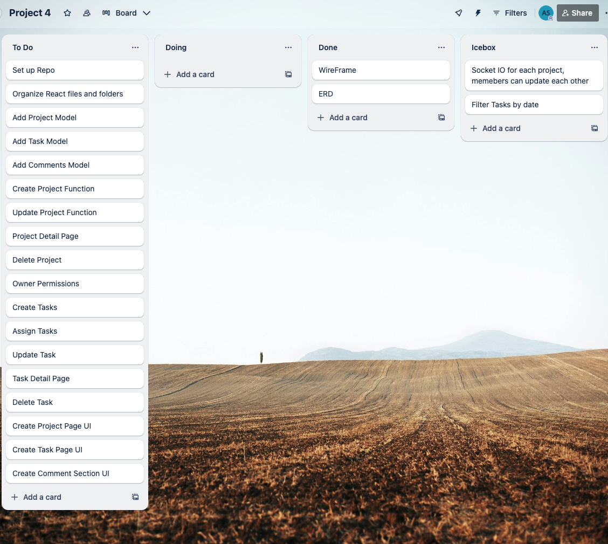
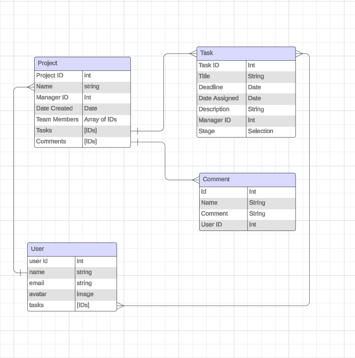

<h1>SEI Project 4: Project Management- An, Abi, Chris</h1>
<h2>Web Description</h2>

Project Management is an app that facilitates effective collaboration among team members, allowing them to manage tasks, communicate about projects, and stay organized with due dates. It promotes a streamlined workflow for project owners to oversee and coordinate team efforts. Project creators are able to assign team members to tasks and can edit and delete their projects. Team members assigned to a task are able to edit and delete that task.

<h2>Planning Material</h2>

 Trello Board 

ERD

<h2>App Pages</h2>

<h2>Technologies Used</h2>

- MongoDB
- Express.JS
- Node.JS
- React.JS
- CSS

<h2>Next Steps</h2>

Some next steps that we are planning to make are adding the live chat feature for the project so users can better collarborate. We also will add comments to the task for th projects as well.

